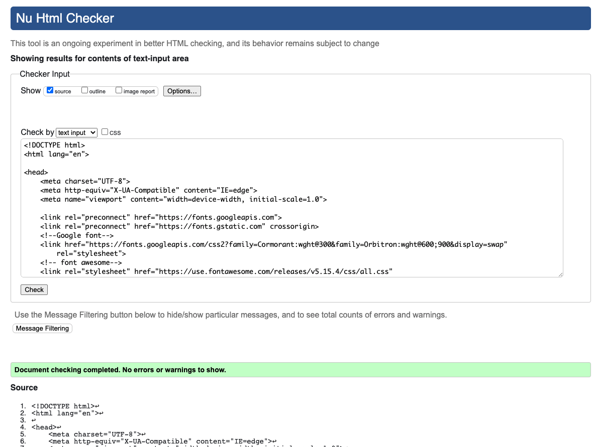

# Space Rock Paper Scissors
* [live link] of the project
## Project Overview
In this project I have taken the classic Rock Paper Scissor game and given it a space theme and storyline. The user i.e the solider, must fire a weapon from his spaceship control panel that consists of **Rock**, **Paper** and **Scissors** which must defeat the enemy, the evil space army and bring peace to the galactic kingdom by winning to two wars. The first war consists of 3 battle rounds and after winning those the final war, where the user only has 5 seconds to fire his selected weapon determining the fate of the galaxy.

## Table of contents:
* [**Space Rock Paper Scissors**](#Space-Rock-Paper-Scissors)
* [**Project Overview**](#project-overview)
* [**User stories:**](#user-stories)
* [**Design**](#design)
  * [**layout**](#layout) 
  * [**Typography**](#typography)  
  * [**Color Scheme:**](#color-scheme)
  * [**Wireframes:**](#wireframes)
* [**Current Features**](#current-features)
* [**Technology**](#technology)
* [**Testing**](#testing)
    * [***Code validation:***](#code-validation)
    * [***test cases***](#test-cases)
    * [**Fixed bugs:**](#fixed-bugs)
    * [**Supported screens**](#supported-screens)
* [**Deployment**](#deployment)
  * [**Gitpod**](#gitpod)
  * [**Github**](#github)
* [**Credits**](#credits)
  * [**Honorable mentions:**](#honorable-mentions)
  * [**General reference:**](#general-reference)
  * [**Content:**](#content)
  * [**Media:**](#media)

## User Stories
* As a user I want to play Rock Paper Scissor.
* As a user I want to understand the rules of the game.
* As a user I want to be able to tell if I am winning or losing against the computer.
* As a user I want to be able to tell what option the computer chose against me.
* As a user I want to be able to reset the game if I lose.
* As a user I want to be able to see if I have won or lost the overall game against the computer.

## Design
### Layout
 * The layout is a minimalistic and clean, a spaceship cockpit with user and computer display screens and control panel that represents the user weapon selection.

### Typography

 * I have used a combination of different styles to convey the theme of space. Using a dark ominous spaceship cockpit background, green highlighted hovering elements i.e display screens and buttons.
 * I also used the font Orbitron very reminesent of the font we have seen and love in the star wars saga.
 * I have also used various galactic solider pngs through out the modals to convey the space storyline.

### Color Scheme
* The primary colors were inspired by the game background. I wanted to  emphasise the green since my first introduction to sci-fi was the the 1979 movie Alien.

### Wireframes
* [Balsamiq](https://balsamiq.com/) was used to create the wireframes and here are the primary mock ups.

## Current Features
* Rules button, so that any user about to play space RPS is knows how to play the game.
* Add a sound on and off button to play music to the game background

* Two display screens one for user weapon and one for computer weapon to be displayed.
* The outcome of every result to be displayed once that round is played under the display screens.
* User selection buttons displayed.
* score displayed and updating with each round and reseting for the final battle.
* Pop up modals for different outcomes within the game

## Technology
*  [HTML:](https://www.w3.org/html/)  - HTMl5 provided the content and the structure for the project. HTML was used to build the UI.

* [CSS:](https://www.w3.org/Style/CSS/) - CSS was used to style.CSS was used to manage the UI.

* [JavaSCript](https://en.wikipedia.org/wiki/JavaScript) - Used for the main interaction with the DOM.

* [Git](https://git-scm.com/) - Git was used to managing the code. Allowing me to create backups whenever significant changes were made to code by utilizing the gitpod terminal to commit to Git and Push to GitHub.

* [GitHub:](https://github.com/) - GitHub was used to externally store repository and site deployment.

## Testing
### Test cases
Through out the project I have carried out regular testing. Through console.log and Chrome developer tools.
* Play **Space Rock Paper Scissor**

* Understand the game rules

* Userr to be able to tell battle round outcomes

* Modals to navigate the outcome and result game

### Code Validation
#### Snky Code Analysis
Snyk - [Snyk](https://snyk.io/) 

#### CSS Markup Validation 
CSS - [W3C Markup Validation Service](https://validator.w3.org/) 
- Congratulations! No Error Found.

#### HTML Markup Validation
HTML - [W3C Markup Validation Service](https://validator.w3.org/) 
- Document checking completed. No errors or warnings to show.

### Supported Screens
* Screen sizes 1024px and over are all compatible for the game
* Only screen sizes ipad, ipad pro and iphone X within Devtools has been to size the game 
ipad

iphone X

## Deployment 
### GitHub
The project was deployed to GitHub pages using the following steps:
 1. Once logged in to **GitHub**, navigate to the site's [repository](https://github.com/hammad25/Space-RPS).
  2. Under repository name , click **Settings**.
  3. In the left sidebar, click **Pages** on the left-hand menu.
  4. Under "Source", select the **Main Branch** and hit **Save**.
  5. To see your published site, under **GitHub Pages**, click the site's URL.

### GitPod
In order to make a local copy of this application, you can clone it by typing the following command in your IDE Terminal:

- `git clone https://github.com/hammad25/Space-RPS.git`

Alternatively, if using Gitpod, you can [click here](https://gitpod.io/#https://github.com/hammad25/Space-RPS) to start a new Gitpod workspace on your account.

## Credits
* Rohit Sharma, my mentor for helping me understand concepts and as always reassuring me to trust the process and digest JavaScript at my own pace and not to compare myself with others.
* The slack community as always **Dave Horrocks** and **Jack Conroy** for taking out time to help me out.
* [Balsamiq](https://balsamiq.com/) was used to create the wireframes
* * [Coolors](https://coolors.co/) - Used to create my colour palette.
* [font Awesome](https://fontawesome.com/) for the variours icons.